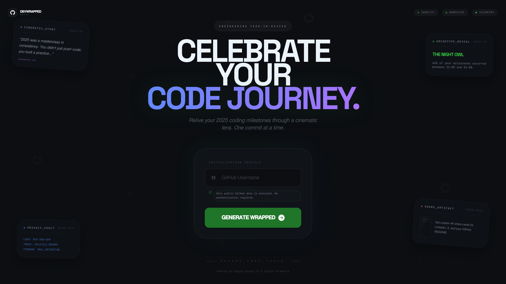

<div align="center">

<h1 style="font-size: 3rem; font-weight: 900; letter-spacing: -0.05em;">
  <span style="color: #39d353;">DEV</span><span style="color: #58a6ff;">_</span><span style="color: #bc8cff;">WRAPPED</span>
</h1>

<sub style="color: #8b949e;">2025</sub>

</div>

<p align="center">
  <kbd><b>[ SYSTEM_STATUS: OPERATIONAL ]</b></kbd>
</p>

<p align="center">
  <i>"2025 wasn't just about the code you shipped. It was about the rhythm you found."</i>
</p>

<p align="center">
  
  
  
</p>

---

## 🎬 Preview

<div align="center">
  
  <p><em>Transform your GitHub activity into a cinematic year-in-review experience</em></p>
</div>

---

## ◈ THE VISION
**DevWrapped 2025** is an elite Year-in-Review engine that transforms raw GitHub telemetry into a cinematic narrative. By combining **Google Gemini AI** with your real-world commit history, we reveal the hidden developer archetype behind your contributions.

## 🚀 Quick Start

1. **Clone & Install**
   ```bash
   git clone <repository-url>
   cd devwrapped-2025
   npm install
   ```

2. **Environment Setup**
   ```bash
   # Create .env file with your API keys
   GEMINI_API_KEY=your_gemini_api_key_here
   VITE_MIXPANEL_TOKEN=your_mixpanel_token_here
   ```

3. **Development**
   ```bash
   npm run dev
   # Visit http://localhost:3000
   ```

4. **Production Build**
   ```bash
   npm run build
   ```

## 📚 Documentation

For comprehensive documentation including architecture, deployment, API references, and troubleshooting, see:

**[📖 DOCUMENTATION.md](./DOCUMENTATION.md)**

## ⚙︎ TECH STACK

- **Frontend**: React 19, TypeScript, Tailwind CSS
- **AI Engine**: Google Gemini (Flash/Lite models)
- **Backend**: Netlify Functions (Serverless)
- **Analytics**: Mixpanel (Privacy-first user insights)
- **Build**: Vite
- **Deployment**: Netlify

## 🔒 PRIVACY & SECURITY

- **Zero Data Retention**: No user data stored on servers
- **Client-Side Processing**: All analysis happens in your browser
- **Public Data Only**: Uses only publicly available GitHub information
- **Secure API Keys**: Server-side storage only, never exposed to clients
- **No Authentication Required**: Works without GitHub login or tokens
- **Privacy-First Analytics**: Anonymous usage tracking with Mixpanel for product improvement
- **HTTPS Only**: All communications encrypted and secure

## 🌟 Features

- **🤖 AI-Powered Insights**: Personalized developer narratives generated by Google Gemini with **AEO (AI Engine Optimization)**
- **📊 Comprehensive Analysis**: Commits, languages, repositories, activity patterns, and more
- **📅 Year Selection**: Choose between current year or previous year analysis (with GitHub API limitations awareness)
- **🎨 Beautiful Visualizations**: Interactive cards and detailed dossiers with GitHub-inspired design
- **📤 Export Capabilities**: High-quality image sharing for social media and portfolios
- **⚡ Streamlined UX**: Direct flow from input to results - no unnecessary steps
- **🔒 Privacy-First**: Zero data retention, client-side processing, anonymous analytics only
- **📱 Mobile Optimized**: Fully responsive design with touch-friendly interactions
- **🎯 Professional Presentation**: Clean, modern interface with smooth animations
- **🧠 Advanced AI Engine**: 10 distinct developer archetypes with confidence scoring and data-driven classification

### 📱 Mobile-First Design
- **Responsive Layout**: Adapts perfectly to all screen sizes
- **Touch-Friendly**: 44px minimum touch targets for optimal mobile experience
- **Monthly Activity Grid**: 
  - Desktop: Single row of 12 blocks
  - Mobile: 2 rows of 6 blocks for better fit
- **Optimized Performance**: Fast loading and smooth interactions on mobile devices
- **Cross-Platform**: Works seamlessly on iOS, Android, and desktop browsers

### What You'll Get:
- **Share Card**: Compact summary perfect for social media
- **Development Dossier**: Detailed analysis with repository insights
- **Tech Stack Visualization**: Color-coded badges showing your technology usage
- **Activity Patterns**: Visual representation of your coding rhythm
- **AI-Generated Narrative**: Personalized story of your development journey with year-specific context
- **Developer Archetype**: One of 10 distinct personas based on your coding patterns
- **Forward-Looking Insights**: Actionable recommendations and growth opportunities
- **Data Transparency**: Clear information about GitHub API limitations and data quality

## 📸 Screenshots

<div align="center">
  
### 🎯 Landing Page

<p><em>Clean, professional interface for GitHub username input with animated background</em></p>

### 📊 Share Card

<p><em>Comprehensive summary card with key statistics and export functionality</em></p>

### 📋 Development Dossier  

<p><em>Detailed analysis with repository cards, tech stack visualization, and activity patterns</em></p>

### 🎨 Complete Experience

<p><em>Full view showing both Share Card and Development Dossier together</em></p>

</div>

---

## 📈 Repository Traffic

Traffic (views/clones) is archived daily via [GitHub Actions](.github/workflows/traffic_archive.yml) to bypass the 14-day API limit. The chart below updates automatically after each run.


*Chart appears after the first workflow run. GitHub may cache the image for a few minutes after updates.*

---

## ◈ SUPPORT & FEEDBACK
- **Complete Documentation**: [DOCUMENTATION.md](./DOCUMENTATION.md)
- **Issues & Bugs**: GitHub Issues
- **Direct Support**: [hello@someshbhardwaj.dev](mailto:hello@someshbhardwaj.dev)
- **Portfolio**: [www.someshbhardwaj.dev](https://www.someshbhardwaj.dev)

## 💖 Support This Project

DevWrapped 2025 is free and open source. If you find it valuable, consider supporting its development:

<div align="center">
  
[](https://github.com/sponsors/Dev-Somesh)

</div>

### 🎯 How Your Support Helps
- 🤖 **AI Innovation**: Enhanced Gemini AI features and insights
- 🚀 **Infrastructure**: Reliable hosting and performance optimization  
- 📱 **Mobile Excellence**: Continued mobile-first development
- 🔒 **Privacy & Security**: Maintaining our zero-data-retention promise
- 🆕 **New Features**: Export formats, visualizations, and analysis types

**All development is transparent and community-driven. [Learn more about sponsoring →](https://github.com/sponsors/Dev-Somesh)**

## 🙏 Credits & Acknowledgments

DevWrapped 2025 is powered by incredible technologies and services:

<div align="center">

| Technology | Purpose | 
|------------|---------|
| 🤖 **[Google Gemini AI](https://ai.google.dev/)** | Intelligent insights & narrative generation |
| 🐙 **[GitHub API](https://docs.github.com/en/rest)** | Comprehensive developer data & analytics |
| 🌐 **[Netlify](https://netlify.com)** | Serverless functions & deployment platform |
| ⚛️ **[React](https://react.dev)** | Modern UI framework & interactive experiences |
| 🎨 **[Tailwind CSS](https://tailwindcss.com)** | Utility-first styling & responsive design |
| ⚡ **[Vite](https://vitejs.dev)** | Lightning-fast build tool & development server |

</div>

*Click the "Credits" button in the app footer to see detailed acknowledgments and visit these amazing projects!*

---

<p align="center">
  <br />
  <b>ARCHITECTED BY <a href="https://www.someshbhardwaj.dev">SOMESH BHARDWAJ</a></b><br />
  <span style="opacity: 0.3; font-family: monospace; font-size: 10px; letter-spacing: 5px;">*** END_OF_MANIFEST_2025 ***</span>
</p>

<p align="center">
  <a href="https://www.someshbhardwaj.dev">
    
  </a>
  <a href="https://www.linkedin.com/in/ersomeshbhardwaj/">
    
  </a>
</p>
